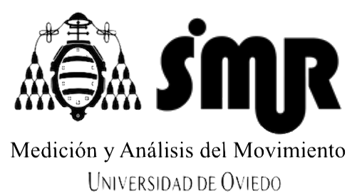

## [SiMuR Research Group](https://simur.dieecs.com/)

# Software

| PyPI  | About |  Repo  |  Cite |
|-------|-----|-------|-------|
| [WearablePerMed utils pre-trained](https://pypi.org/project/uniovi-simur-wearablepermed-utils)  | Python package with utilities to be executed from pre-trained pipeline  | [WearablePerMed utils pre-trained](https://github.com/SiMuR-UO/uniovi-simur-wearablepermed-utils) | [Citation](https://github.com/SiMuR-UO/uniovi-simur-wearablepermed-utils/blob/main/AUTHORS.md) |
| [WearablePerMed pre-trained pipeline](https://pypi.org/project/uniovi-simur-wearablepermed-pipeline)  | Python package to execute pre-trained pipeline  | [WearablePerMed pre-trained pipeline](https://github.com/SiMuR-UO/uniovi-simur-wearablepermed-pipeline) | [Citation](https://github.com/SiMuR-UO/uniovi-simur-wearablepermed-pipeline/blob/master/AUTHORS.md) |
| [WearablePerMed utils train](https://pypi.org/project/uniovi-simur-wearablepermed-ml)  | Python package with utilities to be executed from trained pipeline  | [WearablePerMed utils train](https://github.com/SiMuR-UO/uniovi-simur-wearablepermed-ml) | [Citation](https://github.com/SiMuR-UO/uniovi-simur-wearablepermed-ml/blob/master/AUTHORS.md) |
| [Wearablepermed pipeline ML](https://pypi.org/project/uniovi-simur-wearablepermed-pipeline-ml/)  | Python package to execute trained pipeline  | [Wearablepermed pipeline ML](https://github.com/SiMuR-UO/uniovi-simur-wearablepermed-pipeline-ml) | [Citation](https://github.com/SiMuR-UO/uniovi-simur-wearablepermed-pipeline-ml/blob/master/AUTHORS.md) |

# Latest Research
- Uno
- Dos
